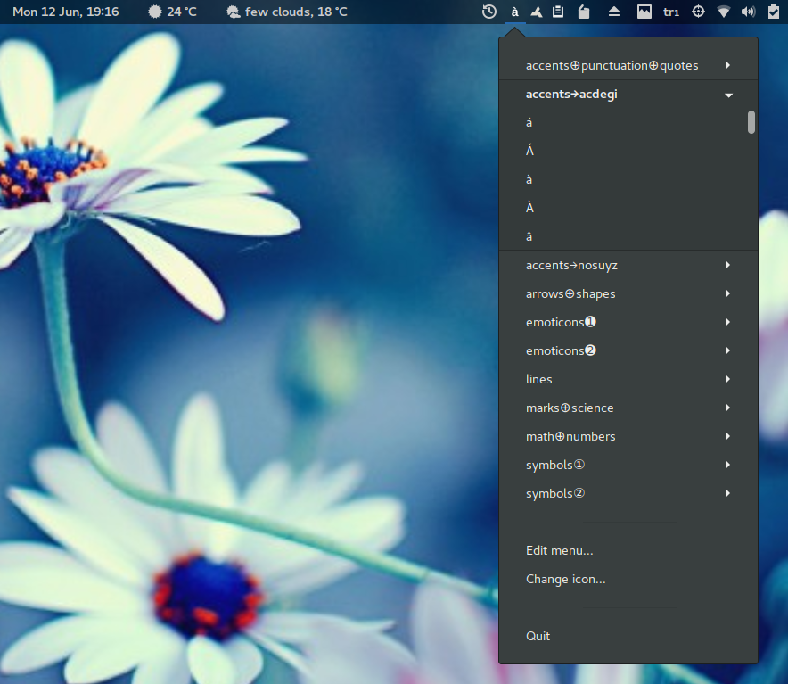

indicator-chars
===============

_Forked from_: https://github.com/tobyS/indicator-chars

_Original Author_: **Tobias Schlitt** <toby@php.net>

App indicator to provide a menu with special characters for simple copying them to clipboard (similar to original characters applet).

Install
-------

- Checkout source files ( especially the DEB package ;-)

  - If not using the DEB package, make sure you have already installed dependencies: `bash` (>= 2.0), `coreutils` (>= 7.0), `diffutils` (>= 3.0), `libc6` (>= 2.0), `python` (>=2.7), `python-appindicator`, `python-gtk2`, `zenity`

- Create/Edit `~/.indicator-chars` file if the one here isn't good enough for you

  - Each row corresponds to a set of chars

  - Optional submenu title prefix: `[title]` (trailing spaces stripped)

  - Optional descriptions after chars: `(description)` (leading &
    trailing spaces stripped)

  - Spaces (apart from above) also count as chars

  - Make sure to use **UTF-8** encoding

Changelog
-----------

1.7: Breeze-style icons added, menu made more compact, and restart command moved from Python to Shell script

1.6: Indicator icon made writable by all to eliminate "sudoers"

1.5: Merged all scripts as functions in one shell script, minor fixes & enhancements

1.4: Changed icons

1.3: Changed icons, added "copy to clipboard on click" feature from: https://github.com/Cyrille37/indicator-chars

1.2: Another menu item added to edit user config file with zenity, etc.

1.1: Issue of root password requirement to change icon resolved, etc.

1.0: Original code forked: sample user config file added, icon made available also for dark themes, menu item added to change icon, DEB file added, etc.
